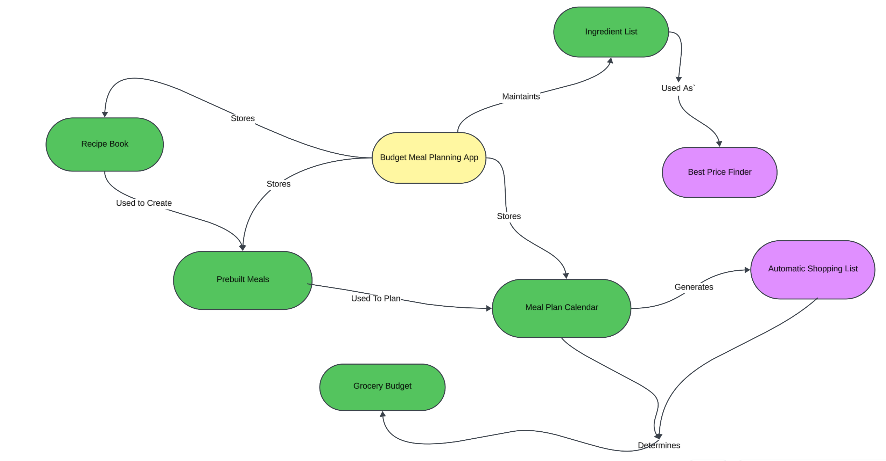

# Project Proposal
---
## 1 Project Name

Budget Meal Planner

## 2 Group Size / Contact Information

Jarom Anderson:  and19081@byui.edu

## 3 Purpose:

To create a budget sensitive meal planning Desktop/Mobile application.

## 4 Background / Prior Knowledge

### Compose Multiplatform: **Beginner**

Last August, I started learning Kotlin and playing around with Jetpack Compose UI. However, that was all on JVM, and I would say I have a very rudimentary undrstanding of things other than syntax and basic UI components. Most of my experience has been in C/C++ console applications and a Web Stack (Html, Css, and Javascript).

### Prior Work By Others:

This is not a completely original idea. Plenty of meal planner apps exist out ther. However, they are all nutrition focused or recipe focused. Looking around at a few of those apps, I found three had a shopping list functions. One was just a text box to add items. One you had to add items manually, but then you could order them through instacart. The other one, you could add the ingredients from the recipe to the shopping list (which was a checklist), you could order them online through instacart. In my app, shopping list/meal plan integration will be high priority not for online orders, but for budgeting.

### What Inspired This Project?

I started creating a spreadsheet to help my wife and I to budget out our groceries and it started to turn into meal planner / recipe tracker / ingredient pricing system. It felt like an app would give it a more unified interface.

### Mind Map

## 5 Description

### Why?

My wife and I have had troubles staying within the grocery budget. I created a spreadsheet meal planner to help us determine what a realistic budget would be. We discovered easiest do this was to create a meal plan, figure out what recipes are used in each meal, come up with a list of ingredients and the amounts we need, then look up the price of each ingredient. Now, being young college students, we are always trying to determine where to get the best bargain on things. That's when we started tracking the prices of different ingredients at different stores. That way we knew where to buy what to save the most money. This app aims to accomplish all of this, automatically doing much of it for you. Other meal planning apps are only focused on planning the meals, not how much they will cost. And not in a budget friendly manner.

### What?

Features:
- **Meal Plan Calendar** (Day, Week, and Month Views)
  - Plan meals for each day
  - Specify:
    - The Meal 
    - Meal Type
    - Meal Time
    - Number of People serving
  - See the estimated cost for the Day/Week/Month/Year.
- **Ingredients List**
  - Track ingredients and their cost at various stores.
- **Recipe Book** Store Recipes Including:
  - Ingredients
  - Cooking Instructions
  - How many the recipe serves 
- **Pre-planned Meals List** Combines multiple recipes and ingredients to create meals
- **Shopping List** Automatically generated shopping list based on planned meals.
  - Automatically places ingredients on the store list that provides the best bargain.
  - Estimates the total cost of shopping list at each store.
  - Allows users to manually move items from one list to another.
  - Allows user move items to already owned list.
- **Cost Analytics** Provide the user comparisons between expected and actual spending. Provide estimates for given periods.
- **OCR Receipt Scanning (Optional)**: Possible receipt scanning, for price updates on ingredients at specific stores. May be too complex for the senior project timeline as the way items are listed on receipts is not always straightforward.

How does this stand up to other apps on the market?  

Most Existing Apps Have:
- Calendar
- Recipe Book
- Shopping List
- Order Ingredients on Shopping List or from Recipe via Instacart
- Scale recipes according to number of servings.

The biggest differences with between my solution and existing solutions is that existing solutions do not focus on budget awareness nor differentiate between recipes and meals. The only cost estimate tool I could find is if you add ingredients to the shopping cart, then click `order via instacart`. In my opinion, a meal consists of one or more recipes/ingredients. Usually you have a main course (like lasagna), and at least one side (like a salad). But sometimes it could be just a single recipe (like a soup) or a single ingredient (like an apple). Differentiating this from just a recipe provides the necessary flexibility. Meal plans are helpful, but things often change (i.e. having a busy day and just ordering fast food). For someone trying to maintain a budget, having cost estimation tools in the meal planner simplify not only planning meals to stay within a budget, but also allow the user (by updating the meal planner), to see relatively how much they spent that month on food. 

### Who?

**Who will use the program?** Budget conscientious users; likely mostly mothers and college students. They will also be my target audience. Young families just starting out are almost always on a tight budget. Having an easy way to know your costs ahead of time, is vital. College students are frequently similarly financially constrained and having the ability to see what costs have been in the past make it possible to set realistic budgets in the future.
 
**Who Pays For It?** Advertisements/me. At least for the initial version. I will pay the one-time $25 to publish to Google Play. My target audience are users that probably aren't willing to pay for the service. Plus, most of what I realistically can do for the senior project doesn't require infrastructure such as physical servers or paid APIs, so even ads are negotiable.  The only cost for me is investing time into development. However, if I were to continue to develop this app I would likely add a paid version offering services that would require paid infrastructure. Especially if I wanted to test and build for iOS as well.

### Platform

I will primarily develop for Android, but maintain cross platform compatibility for possible future expansion into Desktop and iOS. I would develop for iOS at the same time since the differences should be trivial via Compose Multiplatform, but that would require me to own or have access to an Apple Desktop/Laptop and an iPhone, neither of which I own. 

### Workflow

Users opening the app will be greeted with a dashboard containing the day's meal plan and some basic cost analytics such as current shopping list estimate, current month estimate, etc. Navigation icons will allow the user to navigate between, calendar, ingredient list, recipe book, shopping list, meal list, budget analytics, and settings. Ingredient list will be the most important. They are the building blocks of the entire app. That is where users will specify the price of individual ingredients. However, to make it more natural for the user, ingredients will also be created, if they don't exist, while the user is inputting recipes. Once the user has added recipes, they can create pre-planned meals. Once meals are created, they can add them to the calendar, specifying the expected number of people they will feed. Once prices are listed for every ingredient utilized on the calendar, then the shopping lists and budget analytics will be auto generated. Users will be able to generate shopping lists for specified periods (weekly, biweekly, monthly, etc.) as well.

### When Is Good Enough?

When basic functionality is achieved. This means the following features must be implemented:
- Ingredient List
- Recipe Book
- Meal Planner (Pre planned meals)
- Calendar (Day, Week, and Month views)
- Main Shopping List (specified periods optional)
  - Separate lists per store
  - Subtotal per list
  - Total estimate (based on user input grocery tax in settings)
- Cost Analytics (The main purpose of this app)
- Persistent data storage via Room and SQLite (the primary learning curve for me on this project)

## 6 Significance

I would consider this a significant project as it entails bringing an idea all the way to production ready status. It demonstrates understanding in key areas such as System Design, User Interface design (Compose UI), and Database Storage/Integration (SQLite & Room).  

In interviews, my understanding in those areas and the challenges I had to solve would provide me with resources to either demonstrate my skill, or knowledge to aid me in solving technical questions.

As for what I would list on my resume, I would highlight the app's purpose, that it is a full production application, the UI design for multiple form factors/screen sizes (i.e. Desktop/Tablet & mobile), and local data storage integration. If I ever added cloud sync or other services, I would highlight those as well.

## 7 New Computer Science Concepts

**User Interface** 
- **Declarative UI:** While I toyed with Jetpack Compose UI a few months ago, it wasn't that extensive and I mostly used AI so I could explore it. I am still new to the idea of declarative UI. I am used to the traditional imperative approach, specifically using web technologies such as HTML, CSS, and Javascript. That said, I feel like the declarative approach would be more intuitive. I guess time will tell.  
- **Mobile Development:** I have never had to design for mobile/touch friendly interfaces. This is an entirely new area for me. What I do know, it that websites I have made were either not very mobile friendly or broke completely.  
- **GUI Application:** The only full GUI application I have built was one I threw together with the help of AI to demonstrate my fCoSE layout algorithm implementation. And that was recent. Other than that, most of the work I have done is in the form of Console Applications and a couple websites. I am sure I have a lot to learn.  

**Persistent Storage**
- **SQLite:** While I have taken a basic introduction to databases course where we used MySQL, it was only the basics and never integrated with an application. Reading up on it, it seems there are a few significant differences between SQLite and MySQL as well.  
- **Room:** The actual integration. I have done minimal research into Room, but I know it is a well known/frequently used kotlin multiplatform library that provides bindings to interface between the application and SQLite database. However, if I struggle with it, I did find another popular library called SQDelight, that uses a different approach.  

## 8 Interestingness

The real driving reason behind this for me, is that is simplifies a problem I already started trying to solve. While the spreadsheet works, and was a good way to flush out the idea. As an app, data will be much more centralized, mobile friendly, and easier to use. I plan to personally use this application regularly.

That said, the technology and tools I will be learning to use are industry standards, or at least popularly used. Completing this project will give me a solid foundation that I can use in future products or professionally.

## 9 Tasks and Schedule

### Wk01 - Reseach and Project Idea: 10 hours (complete)
- [x] Prototyped the basic idea in a spreadsheet
- [x] Researched what technologies would best help me achive my goal
  - Kotlin Mulitplatform with Jetpack Compose UI
  - Room (Persistent on device storage)
  - Model-ViewModel-View (Idiomatic Kotlin Standard for separation of concerns)
- [x] Downloaded KotlinMultiplatform Template Project & Migrated Android specific code to up to date style
### Wk02 - Proposal: 38 hours (complete)
- [x] The proposal itself was only 12 hours
- [x] However, I jumped the gun a little on prototyping I spent about 25 hours designing the data models and building a skeleton UI.
- [x] Got the app to fully launch on Android for the first time
### Wk03 - Initial Requirements Specification: 10-12 Hours
- [ ] Draft out an initial requirements SRS document 
- [ ] Continue to flush out the UI skeleton
- [ ] Continue to research necessary 3rd Party Libraries
### Wk04 - Functional Prototype & Unit Testing: 10-15 hours
- [ ] Integrate background logic for prototype to more than just look good
- [ ] Demo a functional prototype
- [ ] Continue to research necessary 3rd Party Libraries
### Wk05 - Begin Database Integration: 10-15 hours
- [ ] Begin implementing Room and SQLite for data persistence
### Wk06 - Continue Database Integration: 10-15 hours
- [ ] Continue implementing Room and SQLite for data persistence
- [ ] Begin integration testing.
- [ ] Begin to research nice to have features
### Wk07 - Nice To Have's / Refinement: 10-15 hours
- [ ] Begin working on `Nice To  Have` features
- [ ] Refine SRS document.
### Wk08 - Continue Nice To Have's / Make Up: 10-15 hours
- [ ] Continue working on `Nice To  Have` features 
- [ ] If falling behind schedule, use as a make up week
### Wk09 - Finalize Project: 10-15 Hours
- [ ] Finalize `Must Have` Features
- [ ] Continue working on `Nice to Have` features
### Wk10 - Reflection Document: 10-15 hours
- [ ] Project Complete (hopefully)
- [ ] Begin Reflection Document
### Wk11 - Project Presentation: 5-10 hours
- [ ] Finish & Submit Reflection Document
- [ ] Prepare Project Presentation
- [ ] Present Project
- [ ] Publish Project on Google Play
### Weeks 12 - 14: Flex Time
Theoretically, if all goes well, I should be done with this class by then, but if complications arise, this gives me flexibility to move deadlines.

### **Total Estimated Time: 130-160 hours** 

## 10 Resources
### Hardware
- [x] Laptop (for development)
- [x] Android Phone (primary use testing)
- [x] Android Tablet (larger UI testing)
### Software
- [x] Intellij IDEA IDE
- [ ] Room Plugin
### Initial Documentation
- [Compose Multiplatform (Kotlin Docs)](https://kotlinlang.org/docs/multiplatform/compose-multiplatform.html)
- [Compose Multiplatform (Jetpack Compose Docs)](https://www.jetbrains.com/compose-multiplatform/)
- [Compose Multiplatform (Android Docs)](https://developer.android.com/kotlin/multiplatform)
- [Room Library Docs (Includes SQLite Resources)](https://developer.android.com/kotlin/multiplatform/room)
- [Official SQLite Documentation](https://www.sqlite.org/docs.html)
- [Camera K (An OCR library if I get to receipt scanning)](https://github.com/Kashif-E/CameraK)
- [Publish & Monetize (Google Play)](https://play.google.com/console/about/)
- [Publish App (Android Docs)](https://developer.android.com/studio/publish)
- [Upload to Google Play Console](https://developer.android.com/studio/publish/upload-bundle)
- [Target API Requirements](https://developer.android.com/google/play/requirements/target-sdk)
