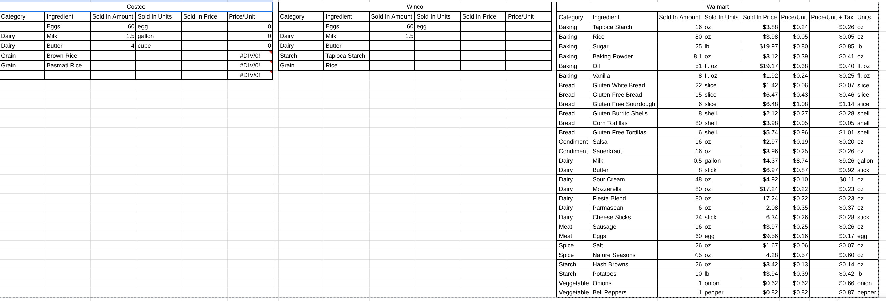
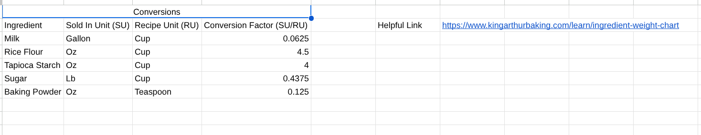
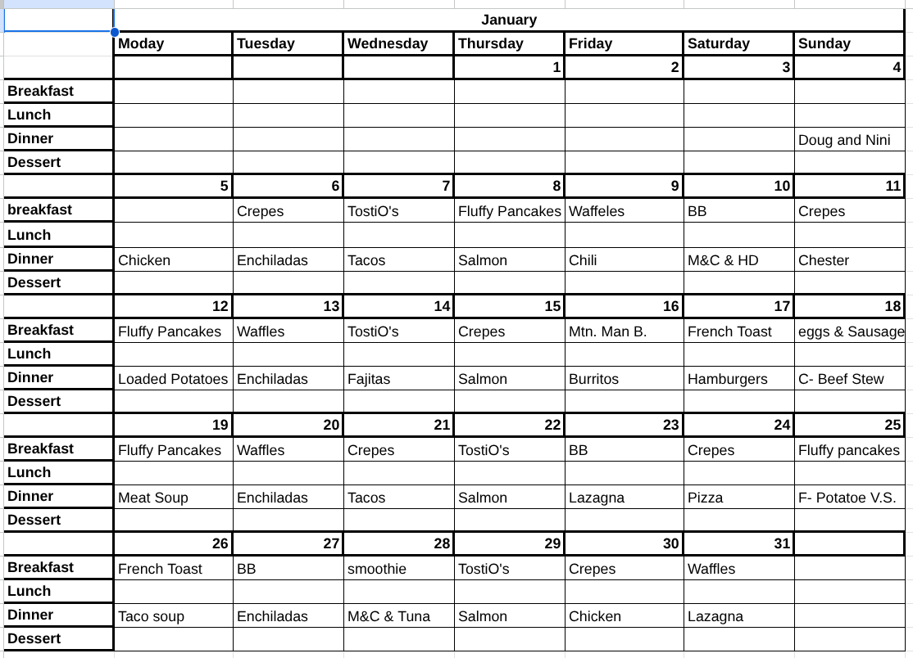
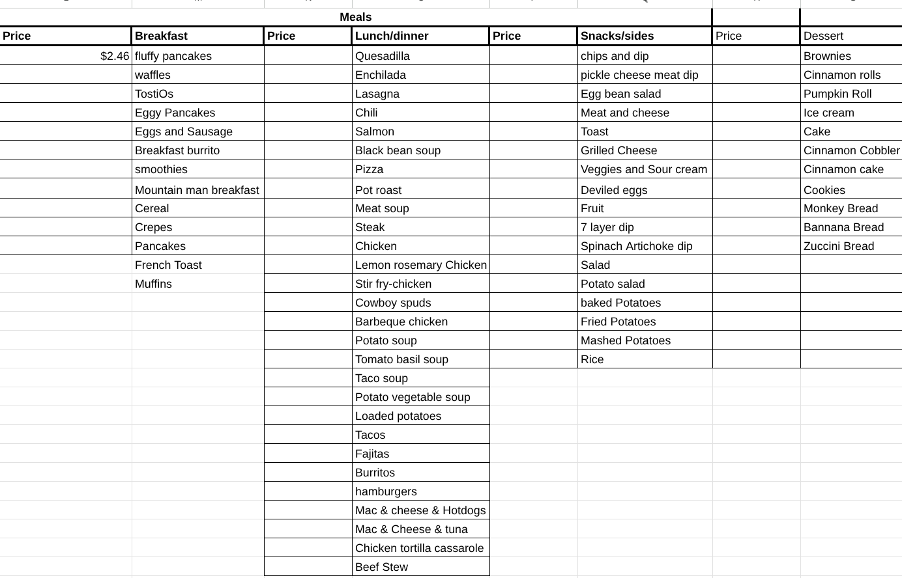
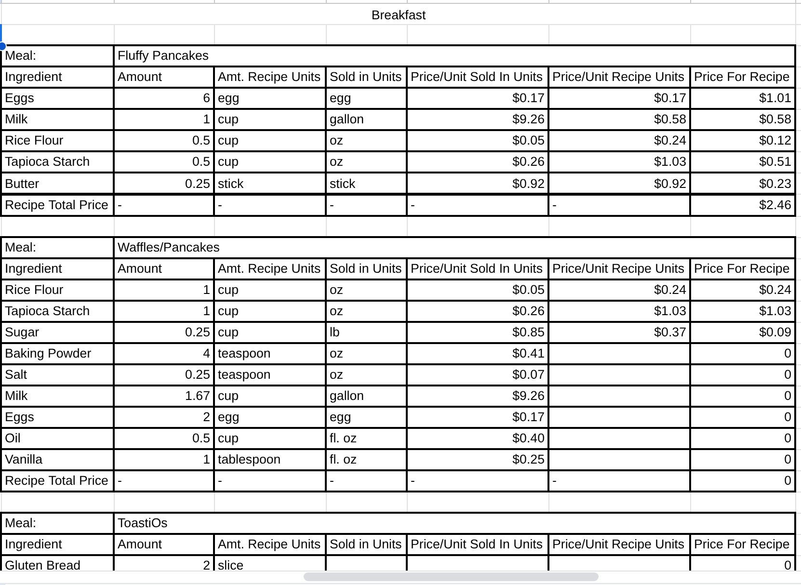
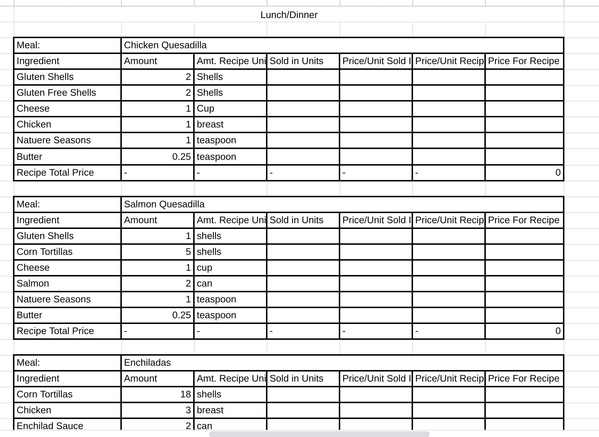

# Week 1

## Proposal:
I would like to explore Android development. I've toyed around with Kotlin a little in the past, but I'd like to actually try to write a functional and useful app. My current Idea is to create a meal planner app that helps determine monthly grocery expenses. Last week, my wife and I started writing a spreadsheet to do this, but I think it would work great as an app. It would remove a lot of duplication, and be much more intuitive. Plus, I think it would be good to explore using Jetpack Compose's declarative UI and compare it to the approach I am familiar with (HTML, CSS, and Javascript).  

What I have in my spreadsheet so far:  
**Stores Sheet:**  
  

**Conversions Sheet:**  
  

**Calendar Sheet:**  
  

**Meals Sheet:**  
   

**Recipes Sheet:**  
  
  

*There is also snacks, sides and desserts, but you probably get the idea.*  

### What I have for the app so far:  
1. **Stores:** A user has a list of local grocery stores. Logically, this would only be the store name.  

2. **Ingredients:** A store of ingredient objects. The ingredient object would contain the price of the item per store, the amount and units it is sold in, and any special conversions (i.e. Oz to Cups varies between flour, sugar, meat, oil, etc). These will be input by the user (no web scraping as store api's usually cost money).  

3. **Recipes:** A place where users can input their recipes. Recipes, will contain Ingredients, with required amounts and units, Instructions, and Servings.  

4. **Meals:** A place where the user can design meals using recipes for main dishes, sides, snacks, drinks, and desserts.  

5. **Calendar:** The place where the user plans meals for each day. They add a meal plan, add the meal, the people eating the meal, and what time it is at.  The application would automatically tailor the recipe to the number of people, compute the needed ingredients and their amounts, and add them to the shopping list. It would also store the estimated cost of the meal. Up at the top of the calendar or in some sort of side menu, the user could see the estimated cost for the week, month, a specified period of time, or year.  

6. **Shopping List:** Items from the meal plan in the calendar are automatically placed in the main shopping list. This list could display each item and the price at each store (color coded to show which is cheaper (red for most expensive, yellow for any stores in between, and green for the cheapest). Automatically, they are added to a shopping list for each store, however users will be able to manually change them lists. They can also say they already have enough of an item and it will be removed.  

7. **Settings:** In here , the user can specify things like their sales tax amount. If not specified then cost estimates will be subtotals only. I would also like to add simple customization settings for dark/light modes, accent color, and Desktop vs Mobile toggle. The reason for the desktop/mobile toggle is because this is cross-platform (Kotlin Compose), I will likely use it on my computer whereas my wife would more likely use it on her phone. However I think cross-application sync is beyond this scope. The other reason for the manual toggle is that tablets have larger screens and would probably still benefit from the desktop layout. And only half screening the app on desktop may benefit from the mobile layout.  

**Note:** The reason this is so well thought out is I spent the week investigating the idea and tech stack. Having done the software design courses and glanced through the modules, I know there will be a lot of design steps, I have skipped by writing this out. I plan to use this idea and refine it using those steps.  

## Resarch:

### Tech Stack
- **Language:** Kotlin
- **UI:** Jetpack Compose (Multiplatform)
- **Separation of Concerns:** Model, ViewModel, View (MVVM)
