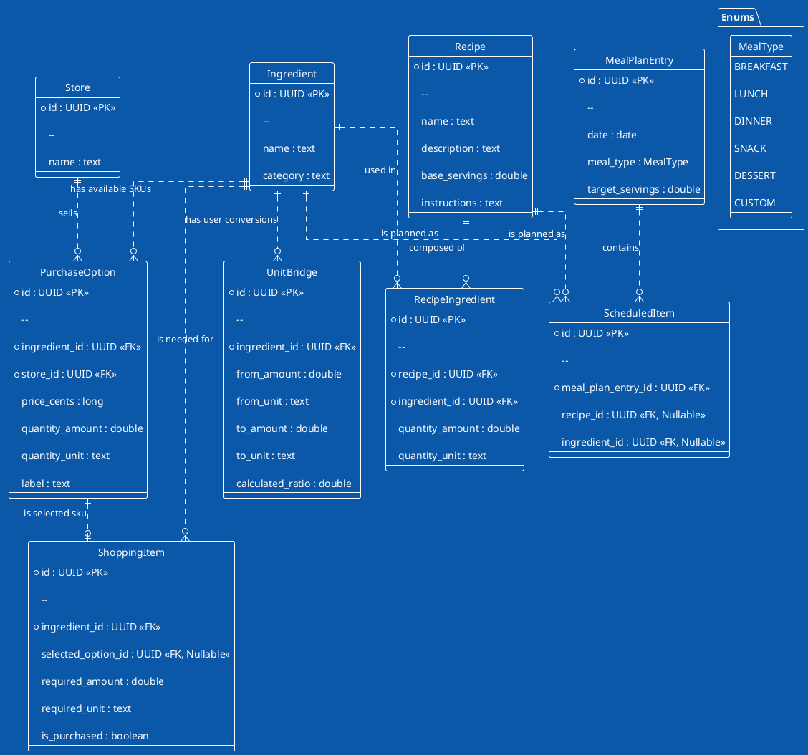

# Wk02

# Added data models

```plantuml
 @startuml

!theme amiga

hide circle

skinparam linetype ortho


' --- Enums (represented logically) ---

package "Enums" {

enum MealType {

BREAKFAST

LUNCH

DINNER

SNACK

DESSERT

CUSTOM

}

}


' --- Inventory & Stores ---


entity "Ingredient" as ingredient {

*id : UUID <<PK>>

-- 

name : text

category : text

}


entity "Store" as store {

*id : UUID <<PK>>

-- 

name : text

}


entity "PurchaseOption" as purchase_option {

*id : UUID <<PK>>

-- 

*ingredient_id : UUID <<FK>>

*store_id : UUID <<FK>>

price_cents : long

quantity_amount : double

quantity_unit : text

label : text

}


entity "UnitBridge" as unit_bridge {

*id : UUID <<PK>>

-- 

*ingredient_id : UUID <<FK>>

from_amount : double

from_unit : text

to_amount : double

to_unit : text

calculated_ratio : double

}


' --- Recipes ---


entity "Recipe" as recipe {

*id : UUID <<PK>>

-- 

name : text

description : text

base_servings : double

instructions : text

}


entity "RecipeIngredient" as recipe_ingredient {

*id : UUID <<PK>>

-- 

*recipe_id : UUID <<FK>>

*ingredient_id : UUID <<FK>>

quantity_amount : double

quantity_unit : text

}


' --- Planning (Calendar) ---


entity "MealPlanEntry" as meal_plan_entry {

*id : UUID <<PK>>

-- 

date : date

meal_type : MealType

target_servings : double

}


entity "ScheduledItem" as scheduled_item {

*id : UUID <<PK>>

-- 

*meal_plan_entry_id : UUID <<FK>>

recipe_id : UUID <<FK, Nullable>>

ingredient_id : UUID <<FK, Nullable>>

}


' --- Shopping List ---


entity "ShoppingItem" as shopping_item {

*id : UUID <<PK>>

-- 

*ingredient_id : UUID <<FK>>

selected_option_id : UUID <<FK, Nullable>>

required_amount : double

required_unit : text

is_purchased : boolean

}


' --- Relationships ---


' Store & Inventory relationships

store ||..o{ purchase_option : "sells"

ingredient ||..o{ purchase_option : "has available SKUs"

ingredient ||..o{ unit_bridge : "has user conversions"


' Recipe relationships

recipe ||..o{ recipe_ingredient : "composed of"

ingredient ||..o{ recipe_ingredient : "used in"


' Planning relationships

meal_plan_entry ||..o{ scheduled_item : "contains"

recipe ||..o{ scheduled_item : "is planned as"

ingredient ||..o{ scheduled_item : "is planned as"


' Shopping relationships

ingredient ||..o{ shopping_item : "is needed for"

purchase_option ||..o| shopping_item : "is selected sku"

@enduml 
```