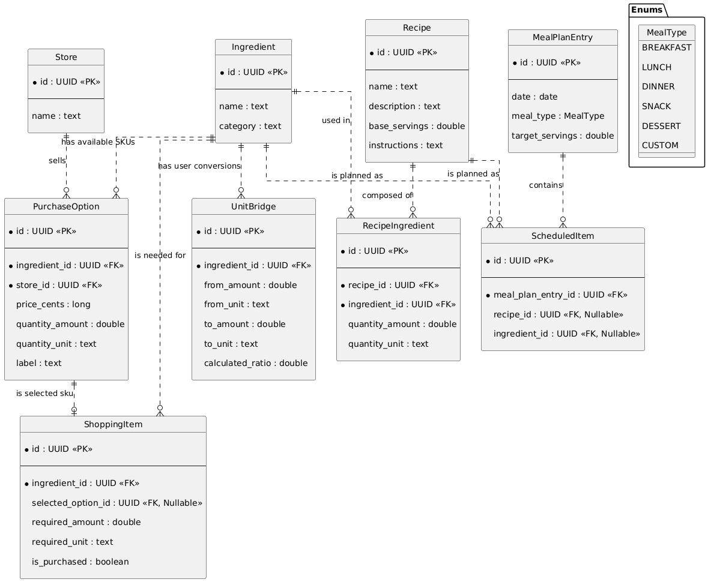

# Wk02

# Research
- Navigtaion Rail for navigation
  - [UI Component](https://developer.android.com/develop/ui/compose/components/navigation-rail)
  - [Navigation Rail Item](https://developer.android.com/reference/kotlin/androidx/compose/material3/package-summary#NavigationRailItem(kotlin.Boolean,kotlin.Function0,kotlin.Function0,androidx.compose.ui.Modifier,kotlin.Boolean,kotlin.Function0,kotlin.Boolean,androidx.compose.material3.NavigationRailItemColors,androidx.compose.foundation.interaction.MutableInteractionSource))
  - [Navigation Docs](https://developer.android.com/develop/ui/compose/navigation)
  - [Material 3 Docs (Nav Rail)](https://m3.material.io/components/navigation-rail/overview)
- [Navcontroller](https://developer.android.com/guide/navigation/navcontroller) for back button capablility
- [List View Docs](https://developer.android.com/develop/ui/compose/lists)
- [Custom Calendar Composable (Android Specific Refactor Required)](https://medium.com/@meytataliti/android-simple-calendar-with-jetpack-compose-v2-b7311bd6e331) Creating a calendar composable. 
- Data Modeling (See ERDs)
- [CameraK Library (OCR for Receipt scanning?)](https://github.com/Kashif-E/CameraK)
- Room Library (For SQLite)
  - [Room Docs](https://developer.android.com/jetpack/androidx/releases/room)
  - TODO: [Room Tutorial](https://developer.android.com/codelabs/basic-android-kotlin-compose-persisting-data-room#0)

# Data Models (Generated from conversations with Gemini AI)
V1:  

V2 (After some prototyping):  

